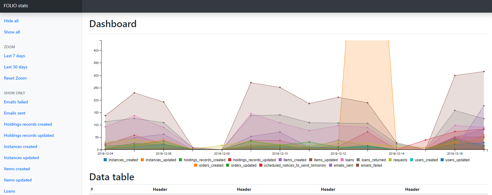
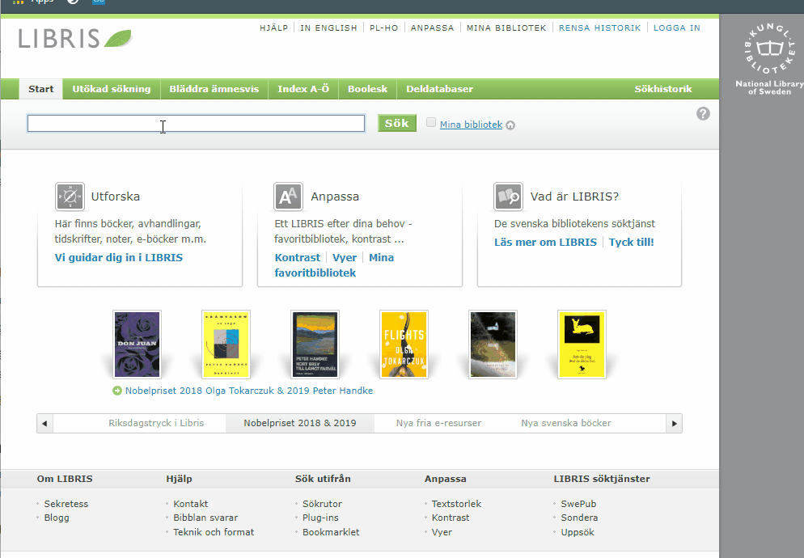

# folio_stats

Collects and displays various indicators in a FOLIO Instance. Indicators are configurable and the tenant in focus can be changed using the environment variables see the .env_temp file



Also acts as a RTAC API for the Swedish union catalog Libris. The following screen cast shows the RTAC response displayed in Librs


# Configuring indicators
TBA

# Installation
Make sure you have Python >= 3.7 installed together with Flask
- Clone the repository
- Rename the .env_temp file to .env and fill in the proper values for the tenant. 
- Make sure the FOLIO user has valid permissions.Below is a good start:
```
{
  "permissionNames": [
    "inventory.all",
    "inventory.instances.collection.get",
    "rtac.all",
    "inventory-storage.holdings.collection.get",
    "perms.users.get",
    "users.collection.get",
    "inventory-storage.location-units.libraries.collection.get",
    "circulation.loans.collection.get",
    "circulation.requests.collection.get",
    "inventory-storage.items.collection.get",
    "inventory-storage.instances.collection.get",
    "circulation-storage.loans.collection.get",
    "orders.collection.get",
    "inventory-storage.instances.item.get",
    "scheduled-notice-storage.scheduled-notices.collection.get",
    "users.item.get",
    "email.message.collection.get"
  ],
  "totalRecords": 17
}
```   
- run Flask using ```pipenv run flask run``` or your do it your way.
- point your browser to http://127.0.0.1:5000/statistics/. After a couple of seconds, you should now see a Graph.
- to load more history, point your browser to http://127.0.0.1:5000/ninety. This will load seven more days of history into the solution for every time you make the request.
